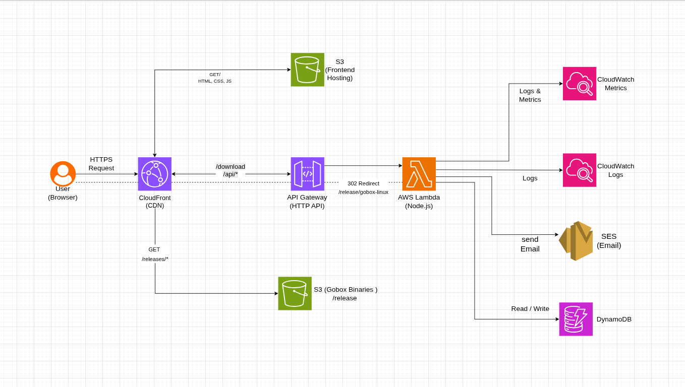

# Veil — Binary Distribution Platform 📦

veil is a minimal, production-grade platform to distribute binaries, track downloads, and collect user feedback — built using a serverless AWS architecture.


---

#  What This Project Does

* Serve veil binaries (Linux / Mac / Windows)
* Track downloads & visits in real-time
* Collect user feedback via UI
* Send email responses (AWS SES)
* Deliver frontend globally using CDN

---

# 🧠 Architecture Overview



---

# 📂 Infra Structure (Terraform)

```txt
infra/
├── main.tf
├── variables.tf
├── outputs.tf
├── providers.tf
├── versions.tf
├── terraform.tfvars
├── backend.tf

├── modules/
│   ├── dynamodb/
│   ├── lambda/
│   ├── apigateway/
│   ├── s3/
│   └── cloudfront/

├── environments/
│   └── dev/

└── scripts/
    └── package_lambda.sh
```

---

# 🧩 Modules Explained

## 🔹 dynamodb

Creates:

* `veil-metrics` → stores counts (downloads, visits)
* `veil-feedback` → stores user feedback

---

## 🔹 lambda

Deploys:

* veil backend (Node.js)
* Handles all business logic
* Integrates with DynamoDB and SES

---

## 🔹 apigateway

Exposes APIs:

```txt
GET  /download
GET  /api/stats
POST /api/feedback
```

---

## 🔹 s3

Creates:

* Frontend hosting bucket
* Binaries storage (`/releases/*`)

---

## 🔹 cloudfront

Main entry layer:

```txt
/              → frontend
/api/*         → backend
/releases/*    → binaries
```

---

#  Core Flows

---

##  Download Flow

```txt
User clicks Download
 ↓
/download?os=linux
 ↓
API Gateway
 ↓
Lambda
 ↓
1. Increment metrics
2. Decide binary
 ↓
302 Redirect
 ↓
CloudFront → S3
 ↓
Download starts
```

---

## 📊 Stats Flow

```txt
GET /api/stats
 ↓
Lambda
 ↓
Fetch DynamoDB data
 ↓
Return JSON
```

---

## 💬 Feedback Flow

```txt
POST /api/feedback
 ↓
Lambda
 ↓
Validate input
 ↓
Store in DynamoDB
 ↓
Send email via SES
 ↓
Return success
```

---

# 🗄️ Data Model

## veil-metrics

| Field       | Example              |
| ----------- | -------------------- |
| metric_type | download_count_linux |
| count       | 123                  |

---

## veil-feedback

| Field     | Example                                 |
| --------- | --------------------------------------- |
| email     | [user@email.com](mailto:user@email.com) |
| message   | "Great tool"                            |
| timestamp | epoch                                   |

---

# ⚙️ Environment Variables

```txt
FROM_EMAIL=verified@domain.com
```

👉 Must be verified in AWS SES

---

# 🛠️ Deployment Steps

## 1. Package Lambda

```bash
cd lambda/veil-handler
zip -r function.zip .
```

---

## 2. Initialize Terraform

```bash
cd infra
terraform init
```

---

## 3. Plan

```bash
terraform plan
```

---

## 4. Apply

```bash
terraform apply
```


#  Security

* Input validation (feedback API)
* OS allowlist (download endpoint)
* CORS enabled
* IAM least privilege

---

#  Performance Design

* Lambda uses 302 redirect (no file serving)
* CloudFront handles delivery
* DynamoDB writes are parallel
* APIs are fail-safe

---

#  Future Improvements

* Rate limiting (WAF / API Gateway)
* CI/CD pipeline
* Monitoring dashboards
* Multi-region support

# Design Principles

* Backend controls logic
* Frontend stays minimal
* CDN-first delivery
* Serverless scalability
* Clean modular infra (Terraform)


<br>
<p align="center"> Built with ☕ - Om Sharma</p>
<p align="center"> Feel free to clone and mess around but dont forget to get credits.</p>
